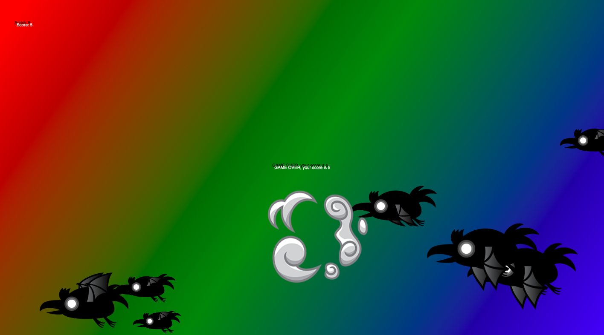
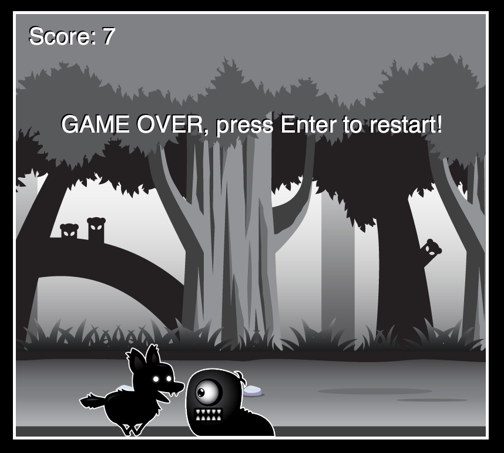
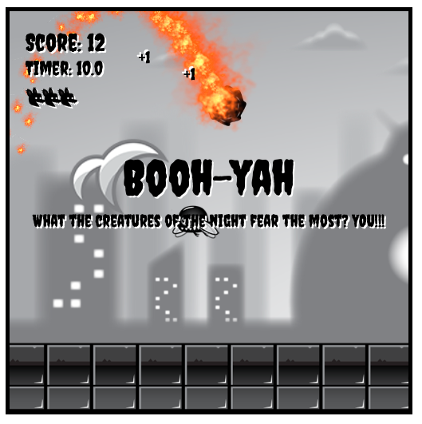

# JavaScript_Game_Projects
Game projects developed based on the freecodecamp video about JavaScript games.

 

## Project 1

 Bird shooter project in witch you use your mouse to shoot the passing birds in orther to get points. 

  

 

## Project 2

 Game in witch you make points by jumping over obstables with the keyboard arrwos. 

  

 

## Project 3

 An upgrade in project 2 that allows the user to crouch down, go faster or slower, and to activate a special hablity.  

  
